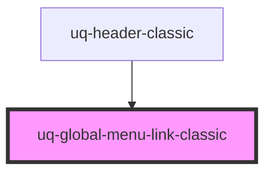

# uq-global-menu-links-classic

<!-- Auto Generated Below -->

## Properties

| Property         | Attribute         | Description | Type     | Default     |
| ---------------- | ----------------- | ----------- | -------- | ----------- |
| `href`           | `href`            |             | `string` | `undefined` |
| `keyboardAccess` | `keyboard-access` |             | `string` | `undefined` |

## Dependencies

### Used by

 - [uq-header-classic](../header)

### Graph

----------------------------------------------

*Built with [StencilJS](https://stenciljs.com/)*
