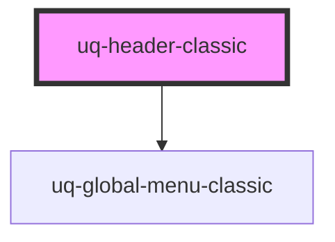

# uq-header

<!-- Auto Generated Below -->

## Properties

| Property         | Attribute          | Description | Type      | Default     |
| ---------------- | ------------------ | ----------- | --------- | ----------- |
| `showGlobalMenu` | `show-global-menu` |             | `boolean` | `undefined` |
| `showSearch`     | `show-search`      |             | `boolean` | `undefined` |

## Dependencies

### Depends on

- [uq-global-menu-classic](../global-menu-classic)

### Graph

----------------------------------------------

*Built with [StencilJS](https://stenciljs.com/)*
